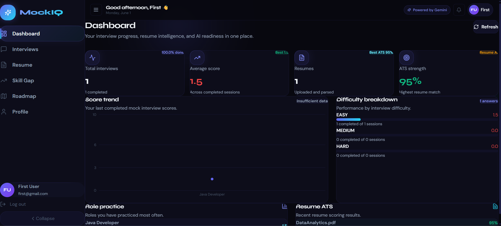
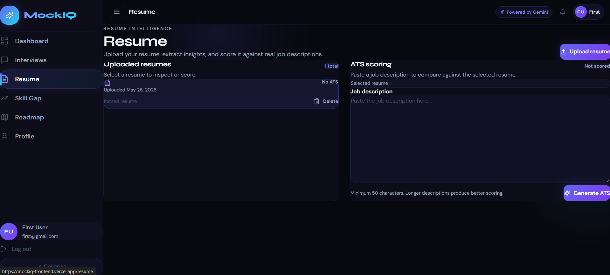
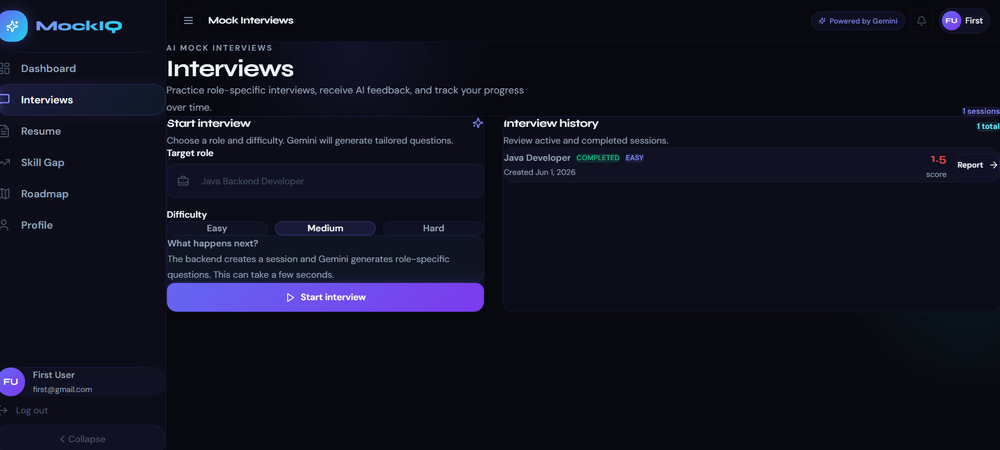
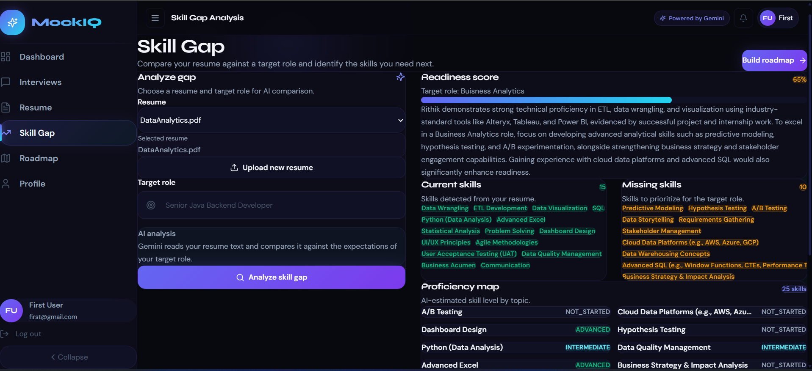
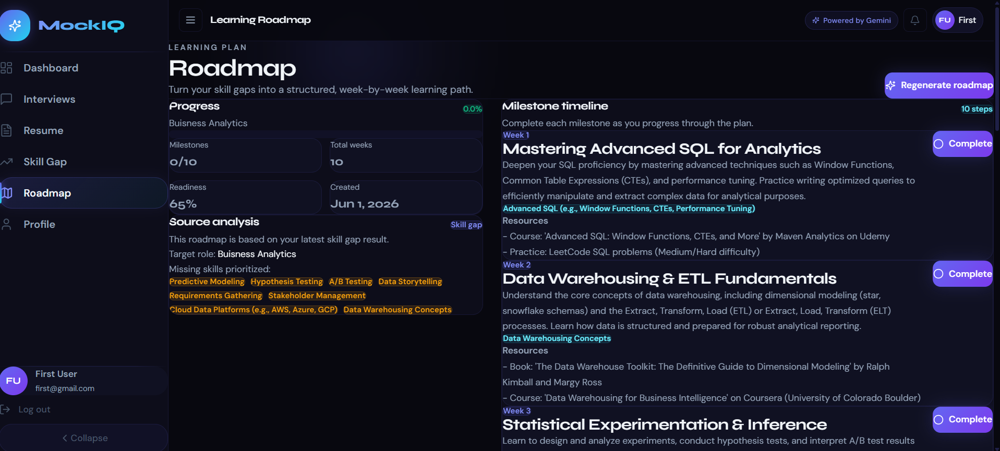
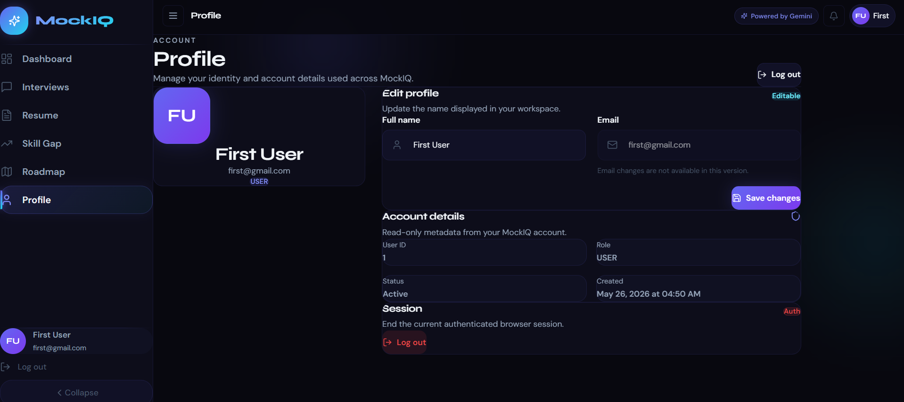

# MockIQ — AI-Powered Mock Interview & Resume Intelligence Platform

MockIQ is a production-deployed AI-powered career preparation platform designed to help students, freshers, and job seekers improve their interview readiness through resume intelligence, AI-generated mock interviews, skill gap analysis, and personalized learning roadmaps.

Built using React, Spring Boot, MySQL, Cloudinary, and Google Gemini AI, MockIQ provides an end-to-end experience for evaluating and improving career readiness.

---

# Live Demo

### Frontend

https://mockiq-frontend.vercel.app

### Backend API

https://ai-mock-interview-platform-f7tu.onrender.com

### API Documentation

https://ai-mock-interview-platform-f7tu.onrender.com/swagger-ui.html

---

# Features

## Authentication & Security

* User Registration
* JWT Authentication
* Secure Login & Logout
* Protected Routes
* Persistent Authentication State
* Profile Management

---

## Resume Intelligence

* Upload PDF resumes
* Cloudinary-based file storage
* Resume text extraction
* ATS score generation using Gemini AI
* Strength analysis
* Missing skills detection
* Improvement recommendations

---

## AI Mock Interviews

* Role-specific interview generation
* Difficulty selection
* AI-generated questions
* Answer submission workflow
* AI evaluation and feedback
* Interview score generation
* Performance summary reports

---

## Dashboard Analytics

* Total interviews completed
* Average interview score
* Resume statistics
* ATS performance tracking
* Skill analysis overview
* Learning progress monitoring

---

## Skill Gap Analysis

* Analyze resume against target job roles
* Detect existing skills
* Identify missing skills
* Generate readiness score
* AI-powered recommendations

---

## Personalized Learning Roadmap

* Generate roadmap from skill gaps
* Weekly milestones
* Progress tracking
* Completion percentage updates
* Personalized learning recommendations

---

# Tech Stack

## Frontend

* React 18
* Vite
* Tailwind CSS
* React Router DOM
* Axios
* Zustand
* React Hook Form
* Framer Motion
* Recharts
* Lucide React
* React Hot Toast

---

## Backend

* Java 21
* Spring Boot 3
* Spring Security
* JWT Authentication
* Spring Data JPA
* Hibernate
* MySQL
* Swagger / OpenAPI
* Cloudinary SDK
* Google Gemini API
* Apache PDFBox

---

## Cloud Services

### Frontend Hosting

* Vercel

### Backend Hosting

* Render

### Database

* Aiven MySQL

### File Storage

* Cloudinary

### AI Provider

* Google Gemini

---

# Architecture Overview

```text
                ┌───────────────────────┐
                │     React Frontend    │
                │       (Vercel)        │
                └───────────┬───────────┘
                            │
                            │ HTTPS REST API
                            ▼
                ┌───────────────────────┐
                │   Spring Boot API     │
                │       (Render)        │
                └───────┬───────┬───────┘
                        │       │
                        │       │
                        ▼       ▼

              ┌─────────────┐   ┌─────────────┐
              │   Gemini AI │   │ Cloudinary  │
              └─────────────┘   └─────────────┘

                        │
                        ▼

                 ┌─────────────┐
                 │ Aiven MySQL │
                 └─────────────┘
```

---

# Project Structure

## Backend

```text
backend/
├── src/main/java/com/mockiq/backend
│   ├── ai
│   ├── config
│   ├── controller
│   ├── dto
│   ├── entity
│   ├── exception
│   ├── repository
│   ├── security
│   └── service
```

## Frontend

```text
mockiq-frontend/
├── src
│   ├── api
│   ├── components
│   │   ├── common
│   │   └── layout
│   ├── hooks
│   ├── pages
│   ├── routes
│   ├── store
│   ├── styles
│   └── utils
```

---

# Screenshots

## Dashboard



## Resume Analysis



## Mock Interview



## Skill Gap Analysis



## Learning Roadmap



## Profile



---

# Local Development Setup

## Prerequisites

* Java 21
* Maven
* Node.js 18+
* MySQL
* Gemini API Key
* Cloudinary Account

---

## Backend Setup

```bash
cd backend

mvn clean install

mvn spring-boot:run
```

Backend:

```text
http://localhost:8080
```

Swagger:

```text
http://localhost:8080/swagger-ui.html
```

---

## Frontend Setup

```bash
cd mockiq-frontend

npm install

npm run dev
```

Frontend:

```text
http://localhost:3000
```

---

# Environment Variables

## Backend

```env
DB_URL=
DB_USERNAME=
DB_PASSWORD=

JWT_SECRET=

CLOUDINARY_CLOUD_NAME=
CLOUDINARY_API_KEY=
CLOUDINARY_API_SECRET=

GEMINI_API_KEY=
```

---

## Frontend

```env
VITE_API_BASE_URL=
```

Production Example:

```env
VITE_API_BASE_URL=https://ai-mock-interview-platform-f7tu.onrender.com/api
```

---

# API Modules

The platform exposes REST APIs for:

* Authentication
* User Profile
* Resume Management
* ATS Analysis
* Mock Interviews
* Dashboard Analytics
* Skill Gap Analysis
* Learning Roadmap

API Documentation:

```text
/swagger-ui.html
```

---

# Deployment

Production Deployment:

```text
Frontend  → Vercel
Backend   → Render
Database  → Aiven MySQL
Storage   → Cloudinary
AI Layer  → Google Gemini
```

Deployment Notes:

```text
docs/DEPLOYMENT.md
```

---

# Key Engineering Highlights

* Built a full-stack AI-powered SaaS application.
* Implemented JWT-based authentication and authorization.
* Integrated Google Gemini AI for resume and interview intelligence.
* Developed responsive mobile-first UI.
* Built REST APIs using Spring Boot and Hibernate.
* Integrated Cloudinary for resume file storage.
* Deployed production infrastructure across Vercel, Render, and Aiven.
* Designed reusable frontend architecture with Zustand and React Hooks.
* Implemented analytics dashboards and roadmap generation workflows.

---

# Future Enhancements

* Refresh Token Authentication
* Email Verification
* Password Reset
* Interview Voice Mode
* Video Interviews
* Resume Version Comparison
* Advanced Analytics
* Notifications
* Subscription Plans
* CI/CD Pipeline
* RAG-Based Career Assistant

---

# Project Status

### Current Status

Production Deployed

### Version

v1.0

### Type

AI SaaS MVP

---

# License

This project is intended for educational purposes, portfolio showcase, and MVP demonstration.
